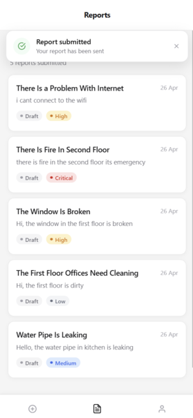
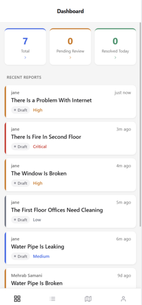
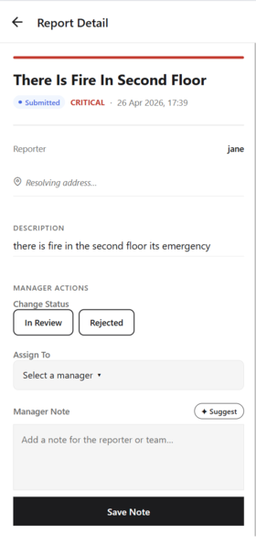
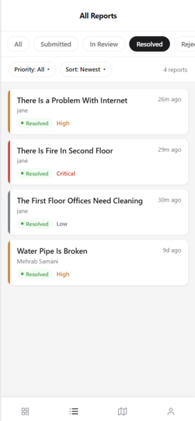

# 🛰️ FieldWatch — Mobile-First Field Reporting Platform

A production-grade field reporting system for inspectors, maintenance teams, and operations staff. Built end-to-end as a full-stack mobile + backend systems project — not a CRUD app.

👉 **[Live Demo](https://app.fieldwatch.mehrabdev.com/)**

---

## 📸 Screenshots

### 📋 Report Submission


---

### 👨🏻‍💼 Manager Dashboard



---

### 📊 Report Feed & Filters


---

## 🧠 What This Project Really Is

FieldWatch is not a form-to-database app.

It is:
- An **offline-first mobile system** with idempotent sync recovery
- A **multi-role workflow engine** enforced across mobile + API boundary
- An **async enrichment pipeline** for media, geocoding, and AI tagging
- A **production-deployed backend** on AWS (EC2 + RDS + S3)

---

## 🏗️ Architecture Overview

```
Expo / React Native client
        |
        | HTTPS
        v
FastAPI API  (EC2)
        |
        +--> PostgreSQL + PostGIS  (RDS)
        +--> Redis
        +--> Celery workers
        +--> S3  (image storage)
        +--> Firebase  (push notifications)
        +--> Gemini  (AI utilities)
```

---

## ✨ Features

- 📝 Mobile report submission with title, description, priority, GPS, and photos
- 📶 Offline-first queue with automatic sync on reconnect
- 👥 Role-based experience for reporters, managers, and admins
- 📄 Cursor-paginated report feed with filters and sorting
- ✅ Manager workflow: assignment, status transitions, action notes
- 🗺️ Native map view with priority-colored report pins
- 🤖 AI-assisted priority suggestions, description enhancement, and similar-report discovery
- ⚙️ Background geocoding, image processing, and notification fanout
- 🔔 Push notifications for new reports and status changes

---

## 🏆 Feature Ranking By Impressiveness

### 1. 🔄 Offline-First Report Sync With Idempotent Recovery

The most technically impressive part of the app.

The mobile client queues reports locally when offline, persists them in storage, and drains the queue automatically on reconnect. The backend accepts an `idempotency_key` per submission, preventing duplicates after retries from network loss or ambiguous failures.

The real work wasn't storing unsent reports — it was making reconnect behavior safe.

---

### 2. 👥 Role-Based Workflow Across Mobile + API

Reporters, managers, and admins move through distinct flows. Those rules are enforced in both the UI and the backend — not just hidden behind conditional buttons.

That matters because once a workflow exists, the API has to defend it explicitly.

---

### 3. 🤖 AI Assistance Embedded Into Operational Flows

The AI layer is not bolted on as a gimmick. It helps where it reduces real friction:

- Incident priority suggestions
- Report description improvement
- Background report tagging
- Similar unresolved report surfacing
- Manager action note drafting

AI stays assistive, not authoritative. The system degrades gracefully when the model is unavailable.

---

### 4. ⚡ Async Media + Geocoding Pipeline

Photo uploads, geocoding, and post-create enrichment run in the background so report creation stays fast. The detail screen polls for completion rather than assuming all dependencies are instant.

Keep the submission path thin. Move enrichment off the critical path. Tolerate partial completion.

---

### 5. 📄 Cursor Pagination, Filters & Sorting

The report feed uses cursor-based pagination across multiple sort orders (newest, oldest, priority). That gives a stable browsing model as the dataset grows — no skipped or duplicated rows as records change between requests.

---

### 6. 🗺️ Native Map-Based Report Visibility

The manager-facing map turns reports into spatial workload, not just list items. Includes coordinate fitting, active/all toggles, and visual priority encoding.

---

### 7. 🔔 Push Notification Workflow

Push registration and device-token delivery don't block the primary user flow. Notifications are useful but treated as best-effort — not a hard dependency for core report submission.

---

## 🛠️ Stack

### Mobile
- React Native + Expo + Expo Router
- TypeScript
- Zustand
- React Native Maps
- Expo Location / Image Picker / Notifications

### Backend
- FastAPI (Python 3.12)
- SQLAlchemy async + Alembic
- PostgreSQL 16 + PostGIS
- Redis + Celery
- AWS S3
- Firebase Cloud Messaging
- Gemini AI

### Infrastructure
- **API** → AWS EC2
- **Database** → AWS RDS (PostgreSQL)
- **Media Storage** → AWS S3
- **Domain** → app.fieldwatch.mehrabdev.com

---

## ⚙️ Engineering Decisions

### Offline Queue First, Not "Hope The Request Succeeds"
Field apps run in bad network conditions. I treated offline capture as part of the product, not an enhancement. The queue persists locally, retries on reconnect, and idempotency keys at the API layer prevent duplicates from turning into operator trust problems.

### Separate Critical Path From Background Enrichment
Report creation is intentionally lightweight. Geocoding, AI categorization, thumbnails, and notifications happen after acceptance. A missing broker, AI outage, or notification error should never block a field worker from filing a report.

### Enforce Roles In The Backend, Not Only In The UI
The mobile app hides and redirects by role, but the backend still enforces who can review all reports, assign work, change statuses, or reach admin screens. Security at the UI layer alone is not security.

### Cursor Pagination Over Page Numbers
The report feed is time-ordered and frequently updated. Cursor pagination avoids duplicated or skipped rows when records change between requests — offset pagination breaks under real operational load.

### Best-Effort Integrations Over Fragile Coupling
Push notifications, AI features, geocoding, and background tagging all degrade gracefully. A more "integrated" system that blocks on external services is operationally brittle. Non-blocking enrichment ships a more reliable product.

---

## 🐛 Engineering Difficulties That Shaped The Build

### Making Offline Sync Safe, Not Just Possible
Storing unsent reports locally is straightforward. Deciding what happens when the same payload is retried after reconnect, app restart, or partial failure is not. Idempotency ended up as a core backend concern — not just a mobile implementation detail.

### Keeping Submission Fast While Enrichment Lags
Image upload, geocoding, and AI tagging have different latency and failure characteristics. Treating them as synchronous makes the app feel unreliable. The detail screen had to be honest about the intermediate "accepted but not yet enriched" state.

### Designing Multi-Role Workflow Without Branch Soup
Role-heavy products get messy fast when every screen checks permissions ad hoc. The engineering work was keeping role logic understandable across routes, stores, services, and authorization boundaries — not just bolting on conditionals.

### Deciding Where AI Helps And Where It Should Stay Out Of The Way
The challenge wasn't calling a model — it was choosing features that help users move faster without creating false confidence. AI stayed in a suggestion role. The app still behaves correctly when AI is unavailable.

---

## 🚀 Local Setup

### Prerequisites
- Docker
- Node.js + npm
- Expo tooling for mobile testing

### Run The Stack

```bash
make up
make migrate
make seed
```

Backend API available at `http://localhost:8000`

```bash
cd packages/mobile
npm install
npm run start
```

---

## 🔑 Environment Variables

Copy `.env.example` to `.env`:

```bash
DATABASE_URL=postgresql+asyncpg://fieldwatch:fieldwatch@db:5432/fieldwatch
REDIS_URL=redis://redis:6379/0
JWT_SECRET=change-me-generate-with-openssl-rand-hex-32
AWS_ACCESS_KEY_ID=your-access-key-id
AWS_SECRET_ACCESS_KEY=your-secret-access-key
AWS_S3_BUCKET=fieldwatch-uploads
AWS_REGION=eu-north-1
FIREBASE_CREDENTIALS_JSON={}
GEMINI_API_KEY=
```

---

## ✅ Quality Checks

```bash
make test
make lint
make typecheck
```

---

## 👤 Author

Built end-to-end as a fullstack systems portfolio project — mobile architecture, API design, async workers, AWS deployment, and everything in between.

🔗 [mehrabdev.com](https://mehrabdev.com)
